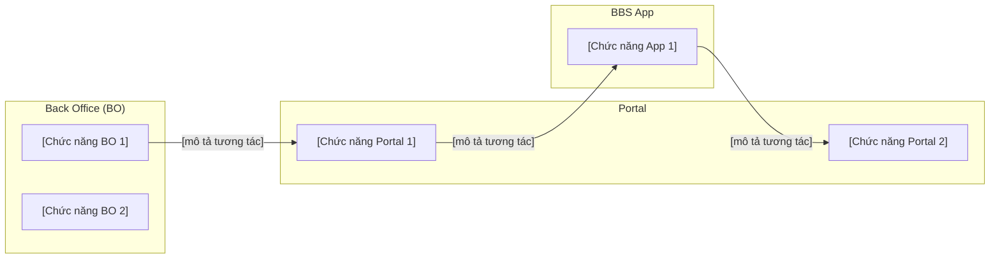
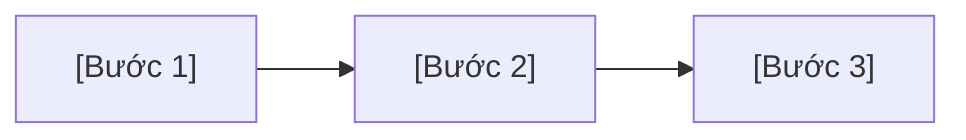
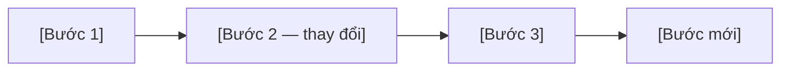
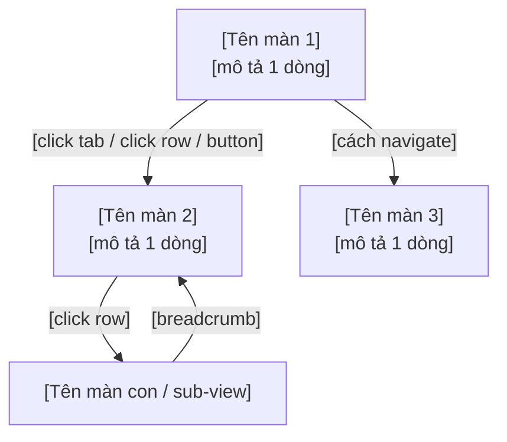

# PRD: [Epic/Feature Name]

> **Version:** 1.0 | **Tác giả:** [Tên BA] | **Ngày:** [DD/MM/YYYY]
> **Trạng thái:** Draft / In Review / Approved

---

## 1. Problem Statement

[2-3 câu: Ai gặp vấn đề gì, hậu quả nếu không giải quyết]

---

## 2. Goals & Non-Goals

### Goals
- [Outcome 1]: [Target] — đo bằng [metric]
- [Outcome 2]: [Target] — đo bằng [metric]
- [Outcome 3]: [Target] — đo bằng [metric]

### Non-Goals
- **[Tính năng/scope X]**: [Lý do không làm trong phiên bản này]
- **[Tính năng/scope Y]**: [Lý do]

---

## 3. System Overview & Flow

> **New Feature** → Dùng 3a: System Interaction Diagram + Function List  
> **Change Request** → Dùng 3b: As-Is / To-Be Flow

---

### 3a. System Interaction Diagram *(New Feature)*

> Diagram thể hiện các hệ thống nào tham gia và luồng tương tác chính ở mức epic.  
> Giữ tối giản: 5–8 node, không đi vào detail — detail thuộc về Spec.

**Function List:**

| Hệ thống | Chức năng | Mô tả ngắn |
|----------|-----------|------------|
| BO | | |
| Portal | | |
| BBS App | | |

---

### 3b. As-Is / To-Be Flow *(Change Request)*

> Diagram thể hiện luồng hiện tại và luồng sau khi thay đổi.  
> Highlight phần thay đổi bằng chú thích hoặc style khác biệt.

**As-Is (Hiện tại):**

**To-Be (Sau thay đổi):**

**Điểm thay đổi chính:**
- [Thay đổi 1]: [Mô tả ngắn — lý do]
- [Thay đổi 2]: [Mô tả ngắn — lý do]

---

## 4. Feature List

| # | Tính năng | Mô tả ngắn | Priority |
|---|-----------|------------|----------|
| 1 | | | P0 |
| 2 | | | P1 |
| 3 | | | P2 |

---

## 5. Screen Map & Navigation

**Navigation pattern:** [Tabs / Sidebar sub-nav / Drill-through / Hybrid]

**Shared shell elements** (persist qua tất cả views):
- [Ví dụ: Tab bar — Tab A │ Tab B │ Tab C]
- [Ví dụ: Filter bar với bộ lọc: TM Program, Date Range, ...]

**Screen Map & Navigation Flow:**

---

## 6. Use Cases

### [Persona 1]
- Người dùng có thể [hành động A]
- Người dùng có thể [hành động B]
- Người dùng có thể [hành động C]

### [Persona 2]
- Người dùng có thể [hành động A]
- Người dùng có thể [hành động B]

---

## 7. Success Metrics

| Metric | Baseline | Target | Đo bằng | Đánh giá sau |
|--------|----------|--------|---------|--------------|
| | | | | |
| | | | | |

---

## 8. Timeline & Milestones

| Milestone | Ngày dự kiến | Deliverables | Điều kiện hoàn thành |
|-----------|-------------|--------------|----------------------|
| Spec hoàn chỉnh | | | |
| Dev complete | | | |
| UAT | | | |
| Go-live | | | |

---

## 9. Open Questions

| # | Câu hỏi | Owner | Blocking? | Cần trả lời trước |
|---|---------|-------|-----------|-------------------|
| 1 | | | | |
