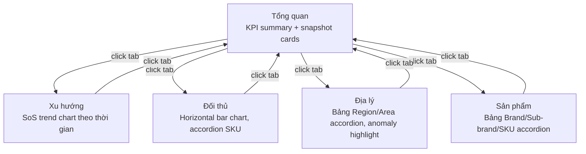

# PRD Guide — Section-by-section detail

## 1. Problem Statement

2-3 câu, trả lời:
- **Ai** đang gặp vấn đề? (persona cụ thể)
- **Vấn đề là gì?** (không phải solution)
- **Hậu quả** nếu không giải quyết?

```
## 1. Problem Statement

[Persona] đang gặp khó khăn khi [hành động cụ thể] vì [nguyên nhân].
Điều này dẫn đến [hậu quả cụ thể], ảnh hưởng đến [business/user outcome].
Nếu không giải quyết, [rủi ro tiếp tục xảy ra].
```

**Tránh:** Mô tả solution trong problem statement.

---

## 2. Goals & Non-Goals

### Goals
3-5 outcomes đo được. Mỗi goal trả lời: "Làm sao biết thành công?"

```
### Goals
- [Outcome 1]: [Target cụ thể] — đo bằng [metric]
- [Outcome 2]: [Target cụ thể] — đo bằng [metric]
- [Outcome 3]: [Target cụ thể] — đo bằng [metric]
```

**Outcome, không phải output:**
- ✅ "Giảm thời gian tạo chương trình từ 30 phút xuống 10 phút"
- ❌ "Xây dựng màn hình tạo chương trình"

### Non-Goals
2-4 thứ KHÔNG làm trong phiên bản này. Phải có lý do.

```
### Non-Goals
- **[Tính năng X]**: Ngoài phạm vi vì [lý do] — sẽ xem xét ở phase 2.
- **[Tính năng Y]**: Phụ thuộc vào [dependency] chưa sẵn sàng.
- **[Tính năng Z]**: Không đủ business value để đưa vào v1.
```

---

## 3. Feature List

Danh sách tên tính năng ở level cao — **không** mô tả chi tiết màn hình.
Chi tiết màn hình thuộc về write-spec-2.

```
## 3. Feature List

| # | Tính năng | Mô tả ngắn | Priority |
|---|-----------|------------|----------|
| 1 | [Tên tính năng] | [1 câu mô tả] | P0 / P1 / P2 |
| 2 | [Tên tính năng] | [1 câu mô tả] | P0 / P1 / P2 |
```

**Priority:**
- P0: Must-have — epic không ship nếu thiếu
- P1: Should-have — quan trọng nhưng ship được không có
- P2: Nice-to-have — thêm vào nếu còn capacity

---

## 4. Screen Map & Navigation

Bắt buộc khi tính năng có **từ 2 màn trở lên** liên kết với nhau. Trả lời 3 câu hỏi:

**1. Navigation pattern là gì?**
- **Tabs** — chuyển view qua tab bar; phổ biến nhất cho analytics/dashboard
- **Sidebar sub-nav** — menu cha expand ra sub-items khi active
- **Drill-through** — click vào data/row → màn chi tiết; back bằng breadcrumb
- **Hybrid** — kết hợp (vd: tabs + drill-through từ bảng)

**2. Shared shell elements là gì?**
Liệt kê component nào tồn tại ở tất cả màn (không phải chỉ 1 màn): tab bar labels, filter bar, page title.

**3. Screen Map & Navigation Flow:**
Dùng Mermaid flowchart để thể hiện quan hệ navigate giữa các màn. Label trên edge ghi cách trigger (click tab / click row / button / breadcrumb).

```
## 4. Screen Map & Navigation

**Navigation pattern:** Tabs

**Shared shell elements:**
- Tab bar: Tổng quan │ Xu hướng │ Đối thủ │ Địa lý │ Sản phẩm
- Filter bar (persist qua tất cả tabs): TM Program, Date Range, Region, Area, Brand

**Screen Map & Navigation Flow:**



_Filter bar persist qua tất cả tabs. Mặc định load Tổng quan._
```

**Khi nào bỏ qua:** Feature là 1 màn đơn lẻ (form, list, dialog) → ghi `N/A — single screen`.

---

## 5. Use Cases

Level: "Người dùng có thể [hành động]" — **không phải** step-by-step flow.
Step-by-step flow thuộc write-spec-2.

Nhóm theo persona nếu có nhiều loại người dùng.

```
## 4. Use Cases

### [Persona 1 — ví dụ: Trade Marketer]
- Người dùng có thể tạo mới chương trình Off-Invoice với đầy đủ thông tin cấu hình.
- Người dùng có thể chỉnh sửa thông tin chương trình trước khi duyệt.
- Người dùng có thể xem danh sách toàn bộ chương trình đang quản lý.

### [Persona 2 — ví dụ: Manager]
- Người dùng có thể duyệt hoặc từ chối chương trình được tạo bởi Trade Marketer.
- Người dùng có thể xem báo cáo hiệu quả của từng chương trình.
```

---

## 5. Success Metrics

| Metric | Baseline | Target | Đo bằng | Thời điểm đánh giá |
|--------|----------|--------|---------|-------------------|
| [Tên metric] | [Hiện tại] | [Mục tiêu] | [Tool/query] | [1 tuần / 1 tháng / 1 quý sau launch] |

**Leading indicators** (thay đổi nhanh — ngày đến tuần):
- Tỉ lệ adoption, task completion rate, error rate

**Lagging indicators** (thay đổi chậm — tuần đến tháng):
- Retention, revenue impact, NPS

---

## 6. Timeline & Milestones

```
## 6. Timeline & Milestones

| Milestone | Ngày dự kiến | Deliverables | Điều kiện hoàn thành |
|-----------|-------------|--------------|----------------------|
| Spec hoàn chỉnh | [Tuần X] | write-spec-2 cho tất cả features | BA + Engineering approve |
| Dev complete | [Tuần X] | Tất cả P0 features done | QA pass |
| UAT | [Tuần X] | User testing với [N] users | Sign-off từ stakeholder |
| Go-live | [Tuần X] | Release lên production | Error rate < 1% |
```

---

## 7. Open Questions

```
## 7. Open Questions

| # | Câu hỏi | Owner | Blocking? | Cần trả lời trước |
|---|---------|-------|-----------|-------------------|
| 1 | [Câu hỏi cụ thể] | [BA/Engineering/Product] | Có/Không | [Ngày/milestone] |
```

**Blocking**: Phải trả lời trước khi bắt đầu write-spec-2 hoặc dev.
**Non-blocking**: Có thể resolve trong quá trình dev.
