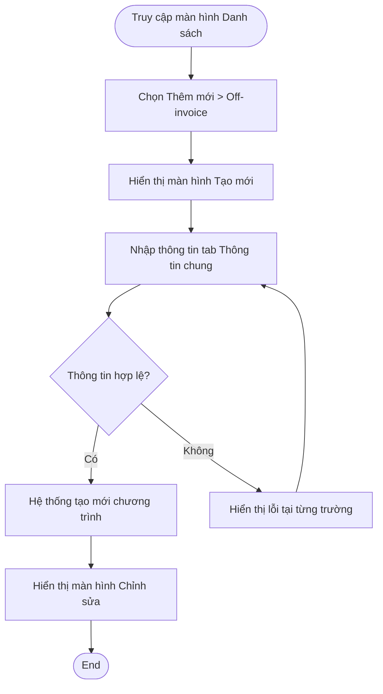

# Write Spec Skill

## Handoff Input
**Receives from:** `write-prd` — 1 feature từ Feature List tại 1 thời điểm

**Expected artifact:** PRD (`artifact: PRD`, `status: Approved`) + tên feature cụ thể cần spec

**Required fields:** Feature Name, Problem Statement, Use Cases từ PRD để lấy context

**Note:** Gọi skill này N lần — 1 lần cho mỗi feature trong Feature List. Không merge nhiều feature vào 1 call.

**Hard gate:** Nếu `status` ≠ Approved → yêu cầu BA hoàn thành HITL trước khi tiếp tục

Writes a **detailed functional spec** per feature or screen — used after write-prd is approved.
Covers workflow diagrams (Mermaid), field-level requirements, data model, and edge cases
for BA-to-Engineering alignment.

All output is in **Vietnamese**.

## Relationship to other skills

```
write-prd (epic overview)  →  [HITL approve]  →  write-spec-2 (this skill, per feature)
What & why at epic level                           How exactly, per screen/feature
```

One PRD → multiple write-spec-2 documents (one per feature/screen in the Feature List).

## When to use

After write-prd is HITL-approved.
Input: one feature or screen from the PRD's Feature List.
Do not use for epic-level overviews — use write-prd for that.

## Input to collect

Ask one at a time. Extract from write-prd output if provided.

1. **Feature name** — which feature from the PRD?
2. **User Story** — role, action, goal (1 sentence)
3. **Jira ticket** — if available
4. **Preconditions** — what must be true before user can use this?
5. **Workflow** — what steps does the user take? (will become Mermaid diagram)
6. **Screens & Navigation context** — which screens are involved? Màn này là tab/view nào trong navigation shell đã define ở PRD Section 4? User arrive từ đâu, leave đến đâu? Component nào là shared (filter bar, tab bar)?
7. **Fields** — what fields/components are on each screen?
8. **Business rules** — ràng buộc nghiệp vụ nào cần áp dụng? (giới hạn, điều kiện, quy tắc tính toán...)
9. **Edge cases** — what unusual or error scenarios need to be handled?
10. **Non-functional requirements** — có yêu cầu đặc thù về performance, security, hoặc khả năng mở rộng không?
11. **Design mockups** — links or placeholders

## Folder Structure & CR Handling

### Cấu trúc folder

```
artifacts/[ID]--[slug]/
├── 01-intake--qualified.md
├── 02-discovery--problem-statement.md
├── 03-planning--prd.md
├── 04-spec--[feature].md          ← single source of truth, luôn là bản mới nhất
└── cr/
    ├── CR-001--[slug].md          ← context doc cho từng CR
    └── CR-002--[slug].md
```

- `04-spec` và `03-planning--prd` là file duy nhất, **luôn phản ánh production state**
- `cr/` chứa context doc cho từng CR — không thay đổi sau khi deployed
- Không có version subfolder (v1.0/, v1.1/) — changelog nằm trong `04-spec`

### Khi CR vào

1. Tạo `cr/CR-00X--[slug].md` với context: vấn đề, root cause, scope thay đổi
2. Update `04-spec`: draft các section bị ảnh hưởng
3. Update `03-planning--prd.md` nếu CR thay đổi scope hoặc feature list ở epic level

### Khi CR deployed lên production

1. Update `04-spec`: rewrite các section bị ảnh hưởng, thêm row vào changelog (có Deployed date)
2. Update `03-planning--prd.md` nếu cần (scope/feature list thay đổi)
3. Update `cr/CR-00X.md`: status → Deployed, thêm deployed date
4. Push `04-spec` lên wiki

---

## Workflow

### Step 1 — Gather information
Extract from write-prd output first. Ask for what's still missing.

### Step 2 — Identify screens, flow, and navigation context
Map out all screens from the workflow. Each screen gets its own field table.
Cũng xác định: màn này nằm ở đâu trong navigation shell từ PRD Section 4 (Screen Map & Navigation)?
- Nếu PRD define tab bar → spec phải ghi rõ "Màn này là tab [X]" trong User Story description
- Nếu shared filter bar → ghi rõ trong Functional Requirements: filter bar persist, không cần user re-select khi đổi tab
- **Navigation gate — 2 tiers:**
  - **PRD mới** (tạo sau khi pipeline có Section 4): Hard gate — thiếu Section 4 → dừng, yêu cầu BA quay lại bổ sung PRD trước.
  - **PRD cũ** (đã Approved trước khi pipeline update, không có Section 4): Soft gate — không block, nhưng hỏi 3 câu inline rồi ghi kết quả vào spec:
    ```
    ⚠️ PRD chưa có Section 4 (Screen Map & Navigation). Trả lời nhanh để tiếp tục:
    1. Feature này có mấy màn? (nếu 1 màn → ghi "standalone", bỏ qua câu 2–3)
    2. Navigation pattern: sidebar drill-through / tabs / modal?
    3. Shell persist qua tất cả màn: sidebar + topbar / chỉ topbar / none?
    ```
    Ghi kết quả vào spec tại Section B (Mô tả) dưới dạng **Navigation note** — không cần sửa PRD.

### Step 3 — Generate Mermaid diagram
Convert the workflow steps into a Mermaid flowchart or sequence diagram.
See `references/mermaid-guide.md` for diagram patterns.

### Step 4 — Write the spec
Follow the output format below.
See `references/format-guide.md` for section detail.
See `references/field-types.md` for field constraint patterns.
See `assets/spec-template.md` for blank template.
See `references/versioning-guide.md` for folder structure & CR workflow.

### Step 5 — Self-check
Run Quality Control checklist before outputting.

## Output File

After BA validates and approves:

1. Set `status: Approved` in the metadata header
2. **Determine base folder:** `artifacts/` nếu tồn tại, `docs/` nếu không, hoặc hỏi user
3. **New Feature:** Tạo flat folder
   - Path: `[BASE]/[ID]--[slug]/04-spec--[feature].md`
   - Ví dụ: `artifacts/VPR-001--display-rules/04-spec--display-rules.md`
4. **Change Request:** Update file hiện có (không tạo folder mới)
   - Rewrite các section bị ảnh hưởng trong `04-spec`
   - Thêm row vào changelog trong `04-spec`
   - Update `03-planning--prd.md` nếu scope/epic thay đổi
   - Tạo `cr/CR-00X--[slug].md` với CR context
5. **Multiple sub-features trong 1 PRD:** Nhiều file 04-spec trong cùng folder
   - Ví dụ: `04-spec--ai-evaluation.md`, `04-spec--manual-evaluation.md`
6. Notify BA: `✓ Saved to artifacts/[ID]--[slug]/04-spec--[name].md`

## Output format

All output in **Vietnamese**. Structure:
 
```
# Spec N. [Feature Name]
 
## Lịch sử thay đổi
## Mô tả tài liệu
  A. Link Jira
  B. User Story
     Mô tả: [1-2 câu mô tả feature này là gì / làm gì]
     User Story: Là một [role], tôi muốn [action] để [goal]
  C. Workflow (Mermaid diagram)
  D. Design (TBD link hoặc link file design-instruction)
  E. Business Rules
  F. Functional Requirements
  G. Non-Functional Requirements
  H. Edge Cases
  I. Bảng mô tả trường — [Section 1]
     Bảng mô tả trường — [Section 2] (nếu có nhiều nhóm)
  J. Use cases / User stories liên quan (bỏ nếu không có)
 
## Open Questions (CHỈ thêm khi có câu hỏi blocking thực sự — nếu không có thì bỏ section này)
 
## HITL Checklist (luôn output ở cuối mỗi spec)
```
 
See `references/format-guide.md` for full section detail.

## Mermaid Diagram

1. Always generate a Mermaid diagram for the Workflow section. See `references/mermaid-guide.md` for patterns.
2. Notify BA: `✓ Saved to artifacts/[folder]/05-ActivityDiagram.excalidraw`

Basic flowchart example:


## Quality Control
 
| Check | Criteria |
|---|---|
| User Story | Format: "Là một [role], tôi muốn [action] để [goal]" |
| Mermaid | Diagram có đủ happy path + ít nhất 1 error path |
| Precondition | Workflow có điều kiện phân quyền ở Normal Course |
| Business Rules (E) | Mỗi BR chỉ mô tả 1 ràng buộc; không chứa validation trường (thuộc Section I) |
| Functional Requirements (F) | Ít nhất 3 FR; không mô tả validation trường hoặc ràng buộc nghiệp vụ (thuộc E, I) |
| Non-Functional Requirements (G) | Có ít nhất 1 NFR đo được (số liệu cụ thể hoặc flag [giả định]); nếu không có đặc thù thì ghi rõ 1 dòng thay vì để trống |
| Edge cases (H) | Ít nhất 3 edge cases, đủ 4 cột: # / Scenario / Input/Điều kiện / Expected behavior |
| Field table (I) | Đủ các cột theo spec-template; đặt dưới dạng "I. Bảng mô tả trường — [Section]" |
| Use cases liên quan (J) | Liệt kê các US/UC bị ảnh hưởng; mỗi dòng có Ticket ID + chiều tác động rõ ràng |
| Required fields | Có note bắt buộc + error message cụ thể trong cột Ràng buộc |
| Given/When/Then | Các trường phức tạp có GWT trong cột Ràng buộc |
## Confidence Level

```
Confidence: [High / Medium / Low]
Missing information: [List]
Assumptions made: [List — need user confirmation]
```

## HITL Checklist

After receiving draft, user validates:
- [ ] User Story đúng intent không?
- [ ] Mermaid diagram đúng flow không? Có bước nào bị thiếu?
- [ ] Navigation context đúng không? Màn này là tab/view gì trong shell? Shared elements (filter bar, tab bar) có được reference không?
- [ ] Business Rules (E) phản ánh đúng ràng buộc nghiệp vụ không? Có rule nào bị thiếu hoặc sai không?
- [ ] Functional Requirements (F) đã cover đủ capability cần thiết chưa?
- [ ] Non-Functional Requirements (G) có con số phù hợp thực tế hệ thống không? Cần confirm với Engineering?
- [ ] Edge cases (H) đã cover đủ chưa?
- [ ] Field table (I) đủ tất cả trường không?
- [ ] Validation rules trong field table đúng business logic không?
- [ ] Use cases / User stories liên quan (J) có đúng và đủ không? Có impact nào bị bỏ sót không?