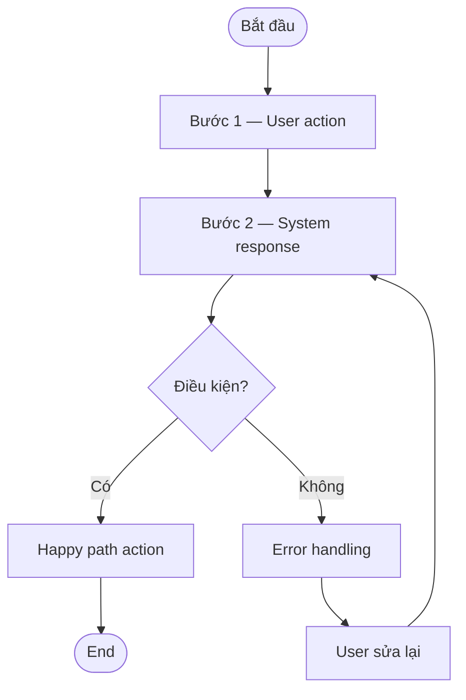
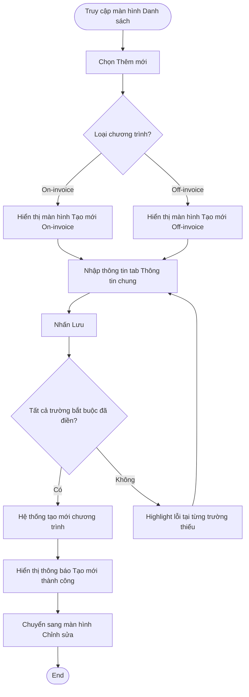
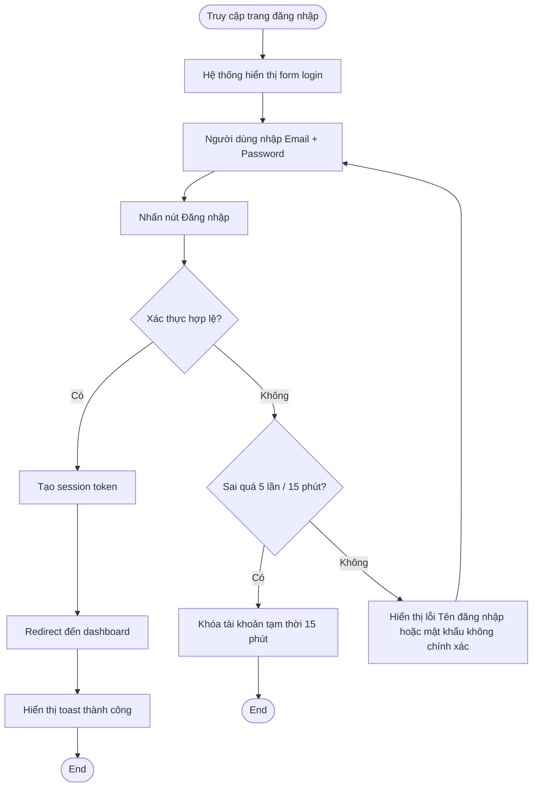
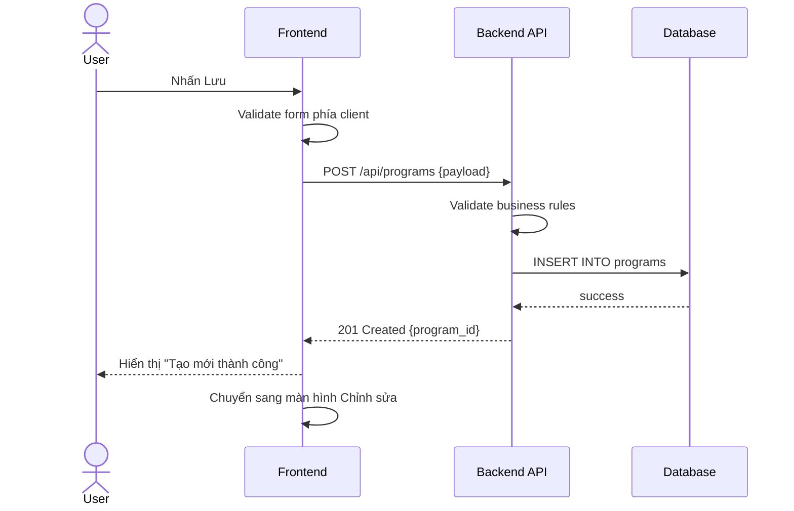
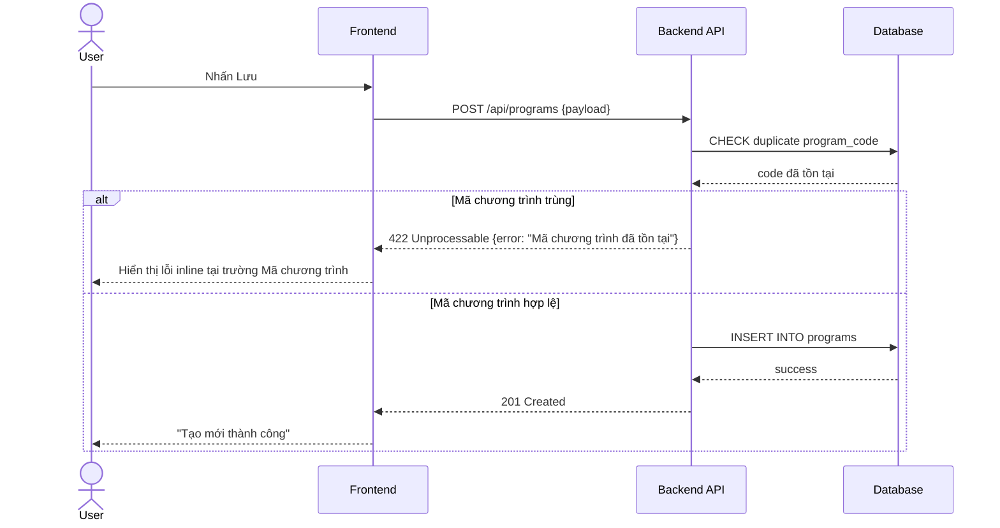
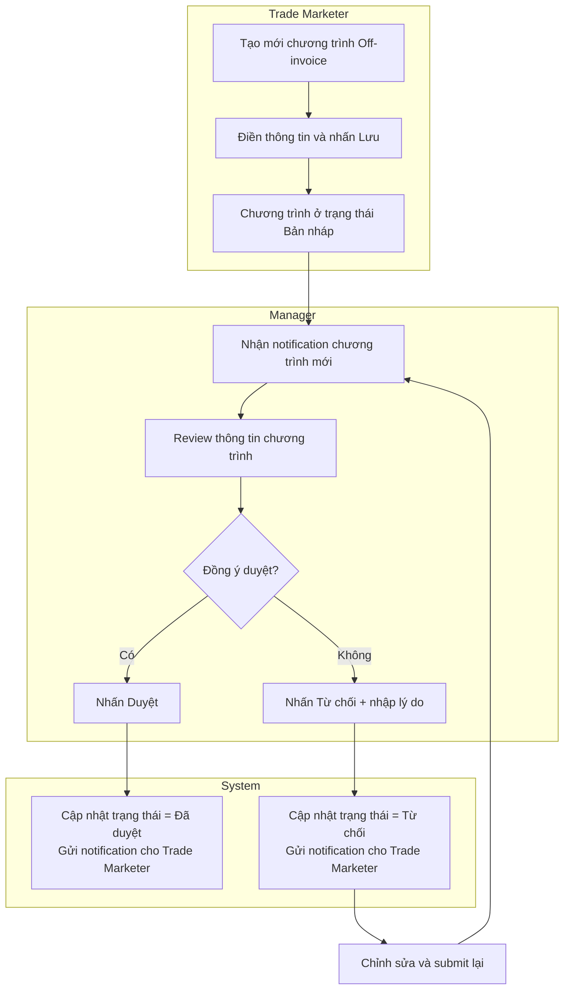

# Mermaid Guide — Workflow Diagram Patterns

## Khi nào dùng loại diagram nào

| Loại | Dùng khi | Ví dụ |
|------|---------|-------|
| `flowchart TD` | Mô tả luồng hành động của 1 người dùng | Tạo mới chương trình |
| `sequenceDiagram` | Mô tả tương tác giữa nhiều thành phần (user, system, API) | Xác thực login, gọi API |
| `flowchart TD` + subgraph | Nhiều actor thực hiện song song | BA → Engineer → QA workflow |

---

## Flowchart — Pattern cơ bản

Dùng cho Basic Flow trong spec.

## Flowchart — Có nhiều nhánh

---

## Flowchart — Luồng login (ví dụ có nhiều failure path)

---

## Sequence Diagram — User và System

Dùng khi cần mô tả tương tác giữa User, Frontend, Backend, Database.

## Sequence Diagram — Có error case

---

## Flowchart với subgraph — Nhiều actor

Dùng khi workflow đi qua nhiều người (Trade Marketer → Manager → System).

---

## Tips

- Mỗi node viết ngắn gọn — không quá 1 dòng
- Dùng tiếng Việt trong node labels để thống nhất với document
- Happy path luôn là nhánh chính, error là nhánh phụ
- Với workflow phức tạp (>10 bước): tách thành 2 diagram — overview và detail
- Dùng `([...])` cho Start/End nodes, `{...}` cho decision nodes, `[...]` cho action nodes
- Sau diagram, thêm mô tả text ngắn giải thích các nhánh quan trọng nếu cần